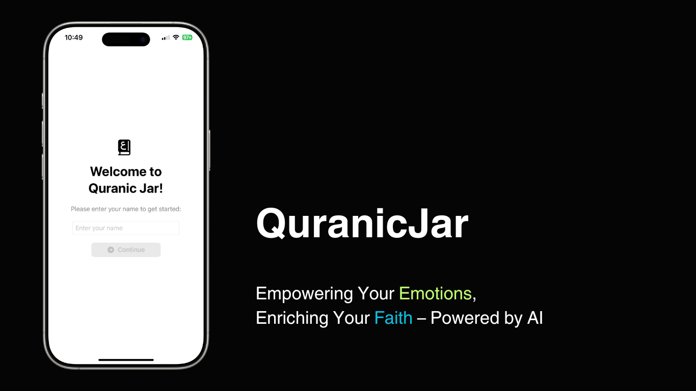
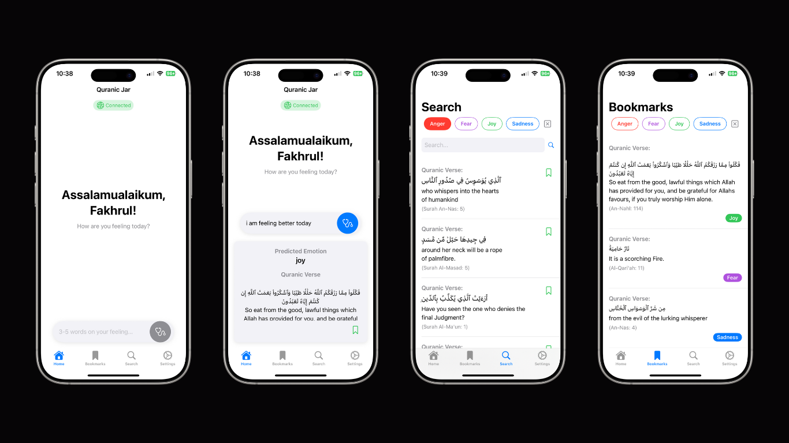

# QuranicJar 🕌✨

QuranicJar is a SwiftUI-based iOS application that predicts a user's emotion based on their input and provides a relevant Quranic verse for guidance and comfort. The app uses a Flask-based backend API powered by fine-tuned Natural Language Processing (NLP) BERT and RoBERTa models for emotion classification.



## Table of Contents
- [Features](#features)
- [File Description](#file-descriptions)
- [How it Works](#how-it-works)
- [How to Run the Project](#how-to-run-the-project)
- [Future Enhancements](#future-enhancements)
- [Contributions](#contributions)
- [Acknowledgments](#acknowledgments)
- [License](#license)


## Features

- **Emotion Prediction**: Users can input their feelings, and the app predicts their emotion using a backend API.
- **Supported Emotions**: As for now, there are 4 supported emotions which are **anger**, **fear**, **joy** and **sadness**.
- **Quranic Verse Recommendation**: Based on the predicted emotion, the app provides a relevant Quranic verse for guidance.
- **Ensemble Model**: Combines predictions from BERT and RoBERTa (NLP) models for improved accuracy.
- **Loading Indicator**: Displays a progress view while the emotion prediction is being processed.



### File Descriptions

1. **`QuranJarApp.swift`**:
   - The main entry point of the iOS app.

2. **`ContentView.swift`**:
   - The main screen where users can input their feelings, predict emotions, and view Quranic verses.
   - Sends API requests to the Flask backend for emotion prediction.

3. **`WelcomeView.swift`**:
   - The initial screen where users are greeted and asked to enter their name.

4. **`app.py`**:
   - Flask-based backend API for emotion prediction.
   - Uses fine-tuned BERT and RoBERTa models to classify emotions.
   - Maps predicted emotions to Quranic verses using a dataset.

5. **`train_bert.py`,`train_roberta.py`,`train_distilbert.py`**
   - Fine tune the pretrain models to the specific dataset

6. **`test_singlemodel.py`,`test_ensemblemodel.py`**
   - Testing the fine-tuned model

7. **`quran_emotions.csv`**:
   - A dataset containing Quranic verses mapped to specific emotions.

8. **`model/`**:
   - Contains the fine-tuned BERT and RoBERTa models and their tokenizers.

## Backend API

The backend API is built using Flask and provides an endpoint for emotion prediction.

### API Endpoint

```
POST /predict
```

### Request Format

The API expects a JSON payload with the following structure:

```json
{
  "text": "User's input text"
}
```

### Response Format

The API returns a JSON response with the following structure:

```json
{
  "predicted_emotion": "Emotion name",
  "probabilities": [0.1, 0.2, 0.5, 0.2],
  "quranic_verse": "Relevant Quranic verse (Surah X, Verse Y)"
}
```

### How It Works

1. The input text is processed by both the fine-tuned BERT and RoBERTa models.
2. The predictions from both models are combined using an ensemble method.
3. The predicted emotion is mapped to a relevant Quranic verse using the `quran_emotions.csv` dataset.

---

## How to Run the Project

### Prerequisites

- Python 3.8 or later
- Flask
- PyTorch
- Transformers library
- pandas

### Backend Setup

1. Clone the repository:
   ```bash
   git clone https://github.com/your-username/QuranicJar.git
   cd QuranicJar
   ```

2. Install the required Python packages:
   ```bash
   pip install -r requirements.txt
   ```

3. Ensure the `quran_emotions.csv` dataset is in the `dataset/` directory.

4. Run the Flask app:
   ```bash
   python app.py
   ```

   The backend will be available at `http://0.0.0.0:3000`.

### iOS App Setup

1. Open the swift directory in Xcode.
2. Run the app on a simulator or a physical device.
3. Ensure the backend API is running and accessible from the device.

## Requirements

### Backend
- Python 3.8 or later
- Flask
- PyTorch
- Transformers
- pandas

### iOS App
- iOS 14.0 or later
- Xcode 12.0 or later
- Swift 5.0 or later

## Future Enhancements

- Add support for more emotions and Quranic verses.
- Improve the emotion prediction model with additional training data.
- Enhance the UI/UX of the iOS app.

## Contributions

Contributions are welcome! Please feel free to submit a Pull Request.

## Acknowledgments

- [Quran Dataset](https://www.kaggle.com/datasets/imrankhan197/the-quran-dataset)
- [Emotionally-Labeled Quran Verses (ELQV)](https://github.com/Arwaalmrzoqi/ELQV)
- [BERT NLP Model](https://huggingface.co/docs/transformers/en/model_doc/bert)
- [RoBERTa NLP Model](https://huggingface.co/docs/transformers/en/model_doc/roberta)

## License

This project is licensed under the MIT License. See the LICENSE file for details.

---

**Developed by Fakhrul Fauzi**  
